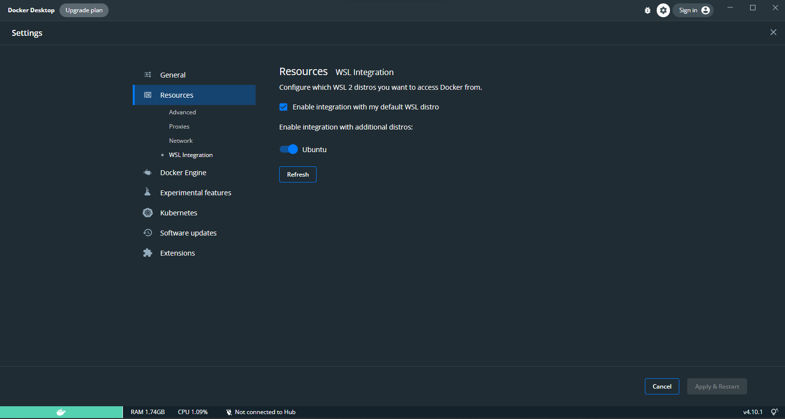

# AutoEz

## Instalação

### Laravel Sail no Windows

O Laravel utiliza o pacote laravel/sail para criar o container

1. Para usuarios de Windows é necessário instalar o WSL2. A instalação mais detalhada pode ser consultada clicando no [link](https://laravel.com/docs/9.x/sail)
2. Instale o [PHP 8.1](https://thishosting.rocks/install-php-on-ubuntu/)
3. Instale o [Docker Desktop](https://docs.docker.com/desktop/install/mac-install/)
4. Para Windows é necessário instalar uma distribuição LINUX no WSL2, siga as instruções no [link](https://ubuntu.com/tutorials/install-ubuntu-on-wsl2-on-windows-10#1-overview) 
5. Acesse as configurações do seu Docker e habilite a 'Use the WSL 2 based engine' na aba General.
6. Defina a sua distribuição instalada como padrão

7. Abra um terminal cmd e digite o comando ```wsl``` e acesse o diretório da pasta pessoal ```cd ~```
8. Clone o projeto via HTTPS
9. Configure o arquivo .env
10. Digite o comando ```php artisan sail:install```
11. Para executar o sistema digite ``sail up -d``
12. Rode os seguintes comandos:
    1. ```sail npm install```
    2. ```sail npm run dev```
 
